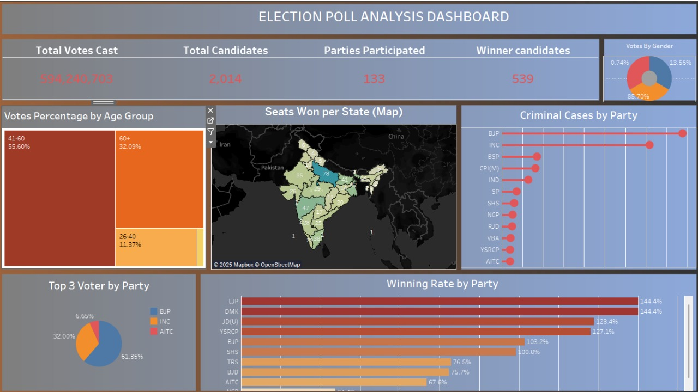

# 🗳️ Indian Election Poll Analysis Dashboard (Tableau)

This project is a dynamic and interactive Tableau dashboard that visualizes key insights from the Indian general election 2019. It aims to provide an intuitive overview of voting patterns, criminal cases by party, gender and age-wise participation, and performance analysis of political parties across different states.

## 📌 Dashboard Highlights

- **Total Votes Cast:** 594,240,703
- **Total Candidates:** 2,014
- **Parties Participated:** 133
- **Winner Candidates:** 539
- **Top Voting Age Group:** 41–60 (55.6%)
- **Votes by Gender:** Majority Male (85.7%)
- **Criminal Cases by Party**
- **Winning Rate & Seat Distribution by Party and State**
- **Top Voter Support by Party (BJP, INC, AITC)**

## 📍 Features

- **Treemaps, Pie Charts, Maps, Bar Graphs** — all interactive and filterable
- Dynamic insights across different demographics and regions
- Highlights political patterns and anomalies like winning rates over 100% and criminal case distributions

## 🧹 Data Cleaning & Preparation

- Raw election data was **scraped and cleaned manually**
- Addressed missing values, merged multiple sources, corrected inconsistencies
- Reformatted data for Tableau compatibility
- Age groups, gender splits, criminal records, and geographic data were normalized

## 🛠️ Tools & Technologies

- **Tableau** – for building the interactive dashboard
- **MS Excel / Python** – for data preprocessing and cleaning
- **Mapbox** – used within Tableau for geospatial visuals

## 📷 Screenshot

> *Note: For full interactivity, open the Tableau dashboard using Tableau Desktop or Tableau Public.*

## 🧠 Learnings

- Deepened my skills in **data visualization** and **storytelling**
- Gained hands-on experience in **data cleaning**, which was the most time-consuming and complex part of this project
- Improved my understanding of **electoral data structure and political analysis**

## 🚀 Future Enhancements

- Add time series comparison (year-wise elections)
- Include more socio-economic indicators

---

**#Tableau #DataVisualization #IndianElections #Dashboard #DataAnalytics #Storytelling #MCAProject**
