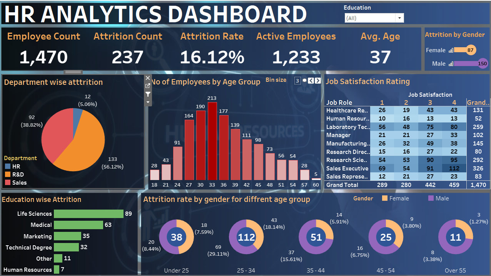

# HR Analytics Dashboard 📊

Welcome to my **first-ever data visualization project**, built using **Tableau**! This HR Analytics Dashboard provides valuable insights into employee attrition, job satisfaction, department-wise trends, and more.

---

## 🚀 Project Overview

This project aims to explore and visualize HR data to better understand workforce trends, attrition patterns, and satisfaction levels across various job roles, age groups, and genders.

---

## 📌 Key Insights

- **Total Employees:** 1,470  
- **Attrition Rate:** 16.12%  
- **Active Employees:** 1,233  
- **Average Age:** 37  
- **Highest Attrition:** Sales Department (56.12%)  
- **Job Satisfaction:** Varies across roles, with noticeable trends in Sales and Research positions  
- **Gender-wise Attrition:** Males show a higher attrition count compared to females  
- **Education-wise Attrition:** Life Sciences background has the highest attrition count  

---

## 📁 Files Included

- `HR.twb` – Tableau packaged workbook
- `Outcome screemshot.png` – A snapshot of the dashboard
- `README.md` – This file
- `HR Data.xlsx`  – Dataset used
- `Background.png`  – Background of dashboard

---

## 📷 Dashboard Preview

---

## 💡 How to Use

1. Open the `.twb` file in Tableau Desktop.
2. Explore the interactive dashboard.
3. Use the filters (like Education dropdown) to dynamically update the visual insights.

---

